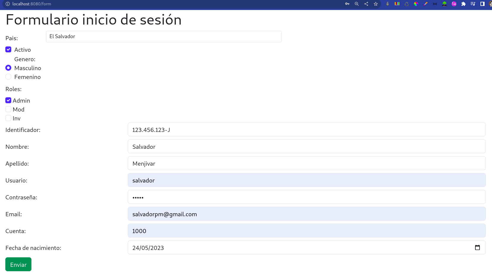
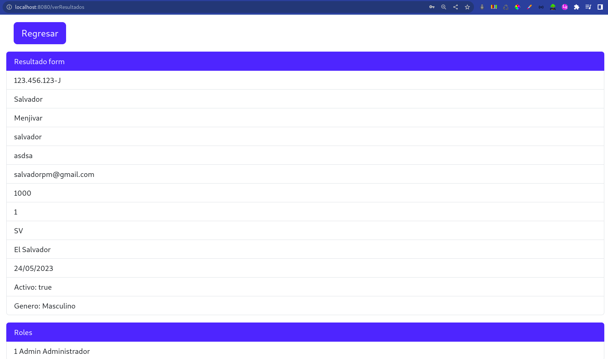
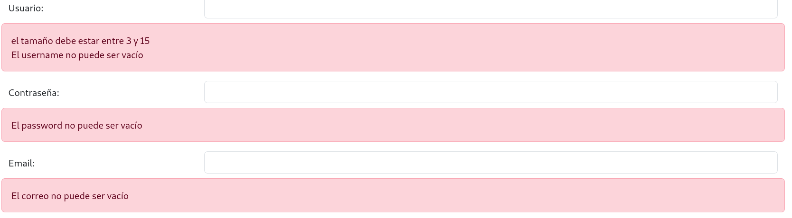

# spring-boot-form
## Manejo de formularios con spring-boot y thymeleaf
Este proyecto esta creado con Spring Boot y se enfoca en:
* Usar validaciones en las entidades
* Capturar datos en el controlador a través de @RequestParam
* Mapeo de la vista con Thymelead de la clases
* Se agregan mensajes de error a la vista
* Se usa uno object de thymeleaf para mejorar el manejo en la vista de como se pasan los datos al controlador
* Se agregan validaciones en formularios
* Se manejan diferentes controles de formularios textos , checkbox, radios, listas, botones, etc
* Se trabaja con entidades, controladores, interfaces y servicios, editors.
* Se utiliza application.properties y messages.properties para el manejo de mensajes en las validaciones en 
 el backend
* Uso de bootstrap 5 para el diseño de las pantallas
## Formulario inicio

## Resultados

## Validaciones

